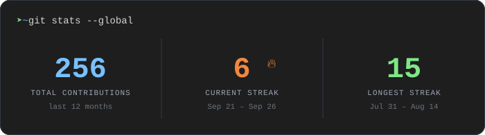
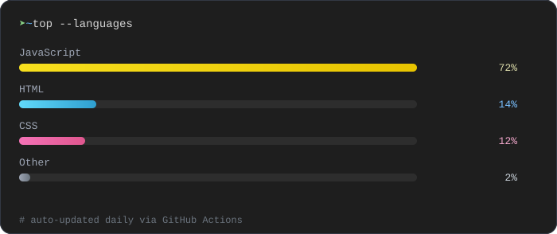

<div align="center">

 Amit Kumar, Frontend Developer. cat role.txt -> React, Redux Toolkit, Tailwind CSS, BCA Student. echo FOCUS -> Building responsive apps, learning DSA, growing into full-stack" width="100%" />

<br/><br/>

<a href="https://github.com/AmitFrontEnd"></a>
<a href="https://www.linkedin.com/in/amit-kumar-585a1b41b/"></a>
<a href="https://leetcode.com/u/Leet_Amit/"></a>

<br/><br/>


</div>

<br/>

## `> about.md`

I'm **Amit Kumar**, a BCA student at **PGGC Sector 11, Chandigarh**, focused on frontend development.

I enjoy building projects where I can go beyond writing UI and actually understand what is happening behind it — API calls, state management, routing, caching, pagination, authentication, performance, and component architecture.

Right now my primary focus is **React + JavaScript + DSA**, while gradually moving towards backend and full-stack development.

```js
// currently.js
const amit = {
  role: "Frontend Developer",
  stack: ["React", "Redux Toolkit", "RTK Query", "Tailwind CSS"],
  learning: ["Node.js", "Express", "Advanced React patterns"],
  lookingFor: "Internship + open-source contributions",
};
```

<div align="center">
  
</div>

<br/>

## `> stack.json`

```json
{
  "frontend":   ["HTML5", "CSS3", "JavaScript", "React", "React Router", "Tailwind CSS"],
  "state":      ["Redux Toolkit", "RTK Query", "shadcn/ui", "Framer Motion"],
  "tools":      ["Git", "GitHub", "Vite", "VS Code"]
}
```

<p align="center">
  
</p>

<br/>

## `> ls projects/`

<table>
<tr><td>

**`StreamTube.jsx`** 🔴

YouTube-inspired video streaming platform built with React.

[](https://streamyoutube.vercel.app/)
[](https://github.com/AmitFrontEnd/StreamTube)

```yaml
stack: [React, Redux Toolkit, YouTube Data API, Tailwind CSS, Vite]
```

- YouTube Data API integration for popular videos, search, video details, channels and comments
- Debounced search with Google search suggestions
- Redux-based search caching
- Infinite scrolling for videos
- Paginated comments using API page tokens
- Intersection Observer for loading more content
- Reusable custom hooks for API-driven features
- Responsive desktop and mobile layouts
- Shimmer loading states and watch-page experience

</td></tr>
<tr><td>

**`NetflixGPT.jsx`** ⬛

Netflix-inspired movie discovery app with AI-powered search.

[](https://netfliixgpt.vercel.app/)
[](https://github.com/AmitFrontEnd/Netflix-GPT)

```yaml
stack: [React, Redux Toolkit, Gemini AI, TMDB API, Tailwind CSS]
```

- Movie discovery using TMDB API
- AI-powered movie recommendations using Gemini
- Redux-based application and search state
- Reusable custom hooks
- Movie lists, cards, trailers and detail views
- Responsive browsing experience
- API loading and error handling
- Multi-language UI support

</td></tr>
<tr><td>

**`CraveHub.jsx`** 🟠

Responsive food ordering web application.

[](https://cravehubfoods.vercel.app/)
[](https://github.com/AmitFrontEnd/CraveHub)

```yaml
stack: [React, Redux Toolkit, Tailwind CSS]
```

- Restaurant and menu browsing
- Centralized cart state with Redux Toolkit
- Add, remove and clear cart functionality
- Delivery charge and GST calculations
- Reusable React components
- API-based menu data fetching
- Shimmer loading states
- Responsive layouts

</td></tr>
</table>

<br/>

## `> git log --learning`

```
* Next Step    → Backend Development  (Node.js, Express, Databases)
* In progress  → JavaScript           (ES6+, Async, DSA, Array/Object patterns)
* In progress  → React                (Advanced Hooks, State, Performance, Architecture)
```

> I'm learning backend step by step, but my current strength and primary focus is **frontend development**.

<br/>

## `> dsa --journey`

Solving **Data Structures & Algorithms in JavaScript** alongside frontend development.

```bash
$ curriculum --list
[x] Arrays
[x] Recursion
[x] Searching & Sorting
[x] Strings
[ ] Linked Lists
[ ] Stacks & Queues
```

I use **LeetCode** to practice problem solving and regularly write down my approach, complexity, and mistakes instead of just memorizing solutions.

🎯 LeetCode: **[Leet_Amit](https://leetcode.com/u/Leet_Amit/)**

<p align="center">
  <a href="https://leetcode.com/u/Leet_Amit/">
    
  </a>
</p>

<br/>

## `> git log --contributions`

```diff
+ Social Winter of Code — Contributor
+ 10+ merged pull requests
+ UI improvements, bug fixes, documentation improvements
+ Collaboration through issues and pull requests
+ Worked with maintainers and contributors
```

🔗 [View my merged contributions](https://github.com/pulls?q=is%3Apr+author%3AAmitFrontEnd+is%3Amerged)

<br/>

## `> git stats --global`

<div align="center">
  
</div>

<br/>

<div align="center">
  
</div>

<br/>

<div align="center">
  
</div>

<br/>

<p align="center">
  
</p>

<p align="center"><sub>Stats above are generated from real GitHub data and refresh automatically every day — no third-party badge service involved.</sub></p>

<br/>

## `> cat philosophy.txt`

```
I don't want to just collect technologies.
I want to understand why a solution works, how the pieces
connect, and how I can write better code next time.

Most of my learning happens through building projects,
debugging things that break, reading documentation,
solving DSA problems, and getting feedback on my code.
```

<br/>

## `> curl amit.dev/contact`

```bash
$ curl -s amit.dev/contact
{
  "email":    "amitemailu@gmail.com",
  "linkedin": "linkedin.com/in/amit-kumar-585a1b41b",
  "github":   "github.com/AmitFrontEnd",
  "leetcode": "leetcode.com/u/Leet_Amit",
  "status":   "open to internships & open-source collabs"
}
```

<div align="center">

<a href="mailto:amitemailu@gmail.com"></a>
<a href="https://www.linkedin.com/in/amit-kumar-585a1b41b/"></a>
<a href="https://github.com/AmitFrontEnd"></a>
<a href="https://leetcode.com/u/Leet_Amit/"></a>

<br/><br/>


**Thanks for visiting my profile.**

</div>
