 

I build responsive web applications, experiment with modern frontend technologies,
and learn by turning ideas into working products.

 

  

<h2 align="center">👨‍💻 About Me</h2>

I'm **Amit Kumar**, a BCA student at **PGGC Sector 11, Chandigarh**, focused on frontend development.

I enjoy building projects where I can go beyond writing UI and actually understand what is happening behind it — API calls, state management, routing, caching, pagination, authentication, performance, and component architecture.

Right now my primary focus is **React + JavaScript + DSA**, while gradually moving towards backend and full-stack development.

  

<h2 align="center">⚡ What I'm Working With</h2>

<table align="center">
  <tr>
    <th align="center">Frontend</th>
    <th align="center">State Management &amp; Libraries</th>
    <th align="center">Tools</th>
  </tr>
  <tr>
    <td align="center" valign="top">
       
       
       
       
       
      
    </td>
    <td align="center" valign="top">
       
       
       
      
    </td>
    <td align="center" valign="top">
       
       
       
      
    </td>
  </tr>
</table>

<h2 align="center">🚀 Featured Projects</h2>

<!-- ───────────── StreamTube ───────────── -->

 

  

**Built with:** React • Redux Toolkit • YouTube Data API • Tailwind CSS • Vite

What I worked on:

* YouTube Data API integration for popular videos, search, video details, channels and comments
* Debounced search with Google search suggestions
* Redux-based search caching
* Infinite scrolling for videos
* Paginated comments using API page tokens
* Intersection Observer for loading more content
* Reusable custom hooks for API-driven features
* Responsive desktop and mobile layouts
* Shimmer loading states and watch-page experience

 

<!-- ───────────── NetflixGPT ───────────── -->

 

  

**Built with:** React • Redux Toolkit • Gemini AI • TMDB API • Tailwind CSS

What I worked on:

* Movie discovery using TMDB API
* AI-powered movie recommendations using Gemini
* Redux-based application and search state
* Reusable custom hooks
* Movie lists, cards, trailers and detail views
* Responsive browsing experience
* API loading and error handling
* Multi-language UI support

 

<!-- ───────────── CraveHub ───────────── -->

 

  

**Built with:** React • Redux Toolkit • Tailwind CSS

What I worked on:

* Restaurant and menu browsing
* Centralized cart state with Redux Toolkit
* Add, remove and clear cart functionality
* Delivery charge and GST calculations
* Reusable React components
* API-based menu data fetching
* Shimmer loading states
* Responsive layouts

<h2 align="center">🌱 Currently Learning</h2>

<table align="center">
  <tr>
    <td align="center" valign="top" width="33%">
       
      <b>React</b>  
      Advanced Hooks 
      State Management 
      Performance 
      Component Architecture
    </td>
    <td align="center" valign="top" width="33%">
       
      <b>JavaScript</b>  
      ES6+ 
      Async JavaScript 
      Array &amp; Object Patterns 
      Data Structures &amp; Algorithms
    </td>
    <td align="center" valign="top" width="33%">
       
      <b>Next Step</b> 
      Backend Development  
      Node.js 
      Express 
      Databases
    </td>
  </tr>
</table>

  <i>I'm learning backend step by step, but my current strength and primary focus is <b>frontend development</b>.</i>

<h2 align="center">🧠 DSA Journey</h2>

I'm solving **Data Structures & Algorithms in JavaScript** alongside frontend development.

Currently working through:

  
  
  
  
  
  

I use **LeetCode** to practice problem solving and regularly write down my approach, complexity, and mistakes instead of just memorizing solutions.

🎯 LeetCode:
**[Leet_Amit](https://leetcode.com/u/Leet_Amit/)**

  

<h2 align="center">🌍 Open Source</h2>

### Social Winter of Code — Contributor

  
  

During SWOC, I contributed to open-source repositories through GitHub pull requests.

* **10+ merged pull requests**
* UI improvements
* Bug fixes
* Documentation improvements
* Collaboration through issues and pull requests
* Worked with maintainers and contributors

🔗 [View my merged contributions](https://github.com/pulls?q=is%3Apr+author%3AAmitFrontEnd+is%3Amerged)

<h2 align="center">📊 GitHub Activity</h2>

  

  <picture>
    <source media="(prefers-color-scheme: dark)" srcset="https://raw.githubusercontent.com/AmitFrontEnd/AmitFrontEnd/output/github-snake-dark.svg" />
    <source media="(prefers-color-scheme: light)" srcset="https://raw.githubusercontent.com/AmitFrontEnd/AmitFrontEnd/output/github-snake.svg" />
    
  </picture>

<h2 align="center">🎯 What I Care About</h2>

> **I don't want to just collect technologies.**
>
> I want to understand **why a solution works, how the pieces connect, and how I can write better code next time.**

Most of my learning happens through building projects, debugging things that break, reading documentation, solving DSA problems, and getting feedback on my code.

<h2 align="center">🤝 Let's Connect</h2>

I'm always interested in connecting with developers, learning from code reviews, 
and finding opportunities to grow through real-world frontend work.

 

  

**Thanks for visiting my profile.**

